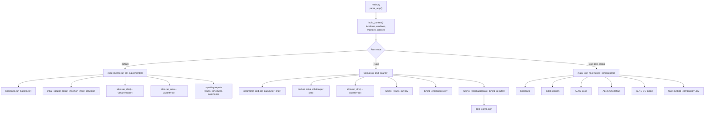
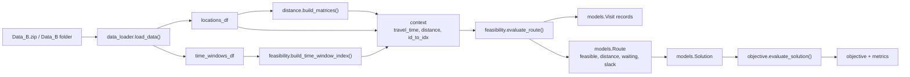
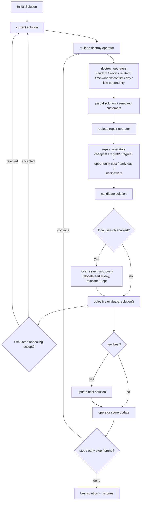
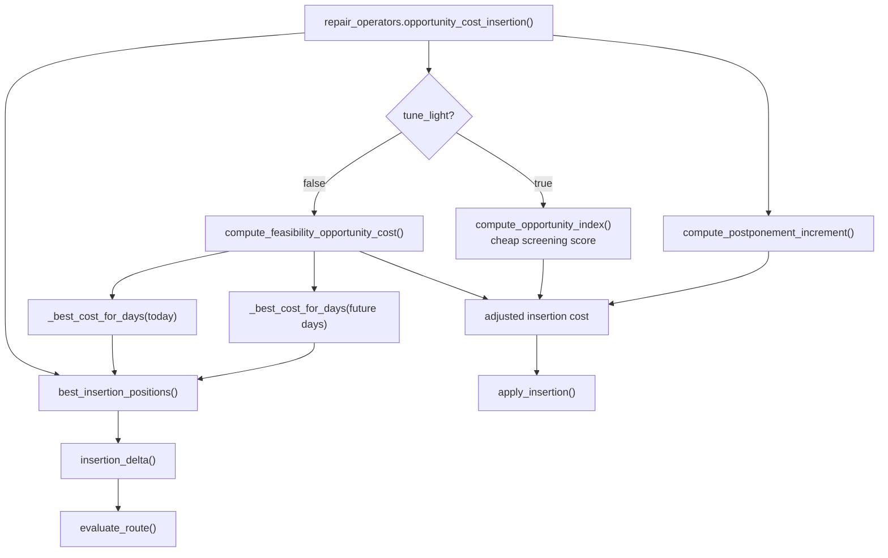
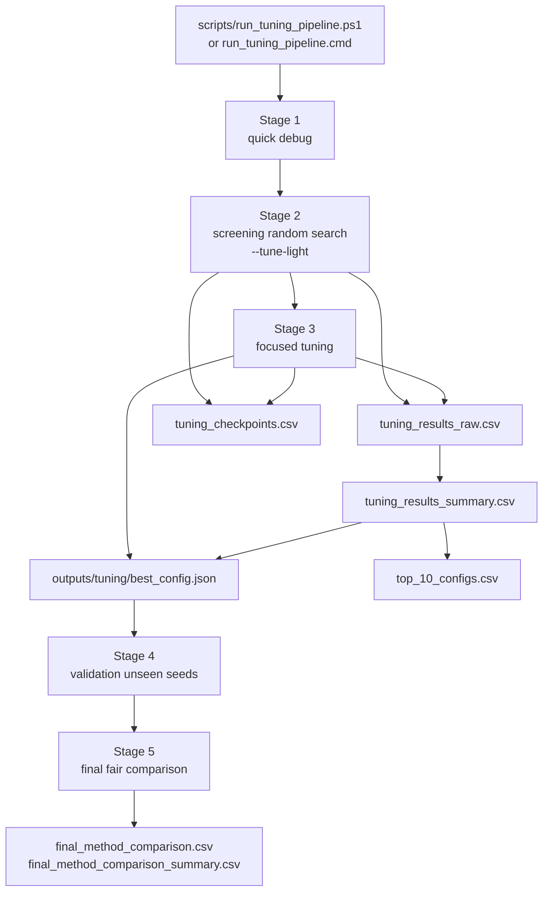
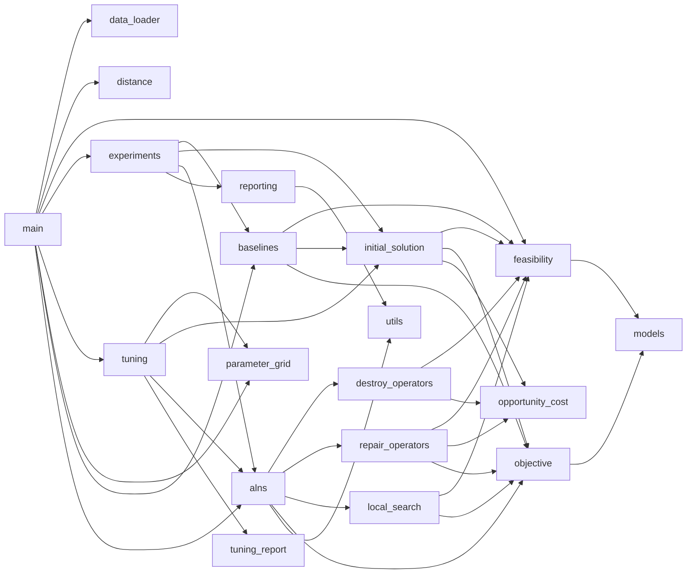
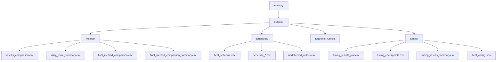

# Codegraph Project Flow

This document redraws the main code paths of the `delivery_alns` project. It is based on the local `.codegraph/codegraph.db` index plus the current Python module/import structure.

## 1. Top-Level Runtime Flow

## 2. Data And Feasibility Spine

Key point: every constructive, repair, local-search, and ALNS move eventually goes through `evaluate_route()`, so multiple time windows and return-to-depot accounting stay centralized.

## 3. ALNS-OC Loop

## 4. Opportunity Cost Subgraph

Why this matters:

- Full mode uses exact insertion-based feasibility opportunity cost.
- `--tune-light` uses a cheaper opportunity index during screening so large searches do not get stuck inside nested future insertion checks.
- Feasibility remains exact because every actual insertion still calls `evaluate_route()`.

## 5. Tuning Pipeline

## 6. Module Dependency Overview

## 7. Important Outputs

## 8. Reading Guide

- Start at `main.py` to understand execution modes.
- Follow `data_loader.py`, `distance.py`, and `feasibility.py` for problem preprocessing and constraints.
- Read `objective.py` before interpreting any comparison CSV.
- Read `initial_solution.py`, `destroy_operators.py`, `repair_operators.py`, and `alns.py` for the optimizer core.
- Read `tuning.py`, `parameter_grid.py`, and `tuning_report.py` for staged/random tuning.
- Read `reporting.py` for what gets exported and how route distance is reconciled with schedules.
